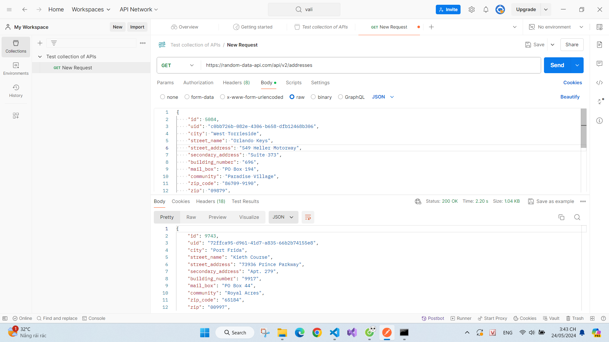

"# Postman" 

Báo cáo Kiểm thử API Địa Chỉ (Addresses)
Mục tiêu Kiểm thử:

Xác minh chức năng CRUD (Create, Read, Update, Delete) của API địa chỉ hoạt động đúng theo tài liệu.
Kiểm tra xử lý các trường hợp lỗi như dữ liệu đầu vào không hợp lệ, tài nguyên không tồn tại, v.v.
Đánh giá (chưa có thông tin về đánh giá) hiệu suất và khả năng mở rộng của API (thông tin này có thể cần bổ sung sau khi thực hiện kiểm thử hiệu suất).
Phạm vi Kiểm thử:

Kiểm thử chức năng: Thực hiện các ca kiểm thử cho các endpoint CRUD.
Kiểm thử dữ liệu đầu vào: Kiểm tra các trường hợp dữ liệu đầu vào hợp lệ và không hợp lệ.
Kiểm thử xử lý lỗi: Kiểm tra các mã lỗi HTTP và thông báo lỗi trả về.
Lưu ý: Kiểm thử hiệu suất chưa được thực hiện trong báo cáo này.
Tài liệu API (Giả sử):

Các chức năng chính của API bao gồm:
GET /api/v2/addresses: Lấy danh sách địa chỉ ngẫu nhiên.
GET /api/v2/addresses/{id}: Lấy thông tin của một địa chỉ cụ thể dựa trên ID.
POST /api/v2/addresses: Tạo một địa chỉ mới.
PUT /api/v2/addresses/{id}: Cập nhật thông tin của một địa chỉ.
DELETE /api/v2/addresses/{id}: Xóa một địa chỉ.
Kết quả Kiểm thử:

Kiểm thử chức năng:

(Cần thực hiện kiểm thử và điền thông tin kết quả)
Thực hiện các ca kiểm thử để xác minh tính năng CRUD hoạt động đúng với tài liệu.
Kiểm tra xem dữ liệu được trả về có đầy đủ các thuộc tính theo tài liệu (ví dụ: id, city, street_address, v.v.).
Kiểm thử dữ liệu đầu vào:

(Cần thực hiện kiểm thử và điền thông tin kết quả)
Thực hiện các ca kiểm thử với dữ liệu đầu vào hợp lệ và không hợp lệ.
Kiểm tra xem API có xử lý đúng các trường hợp dữ liệu đầu vào không hợp lệ, trả về mã lỗi 400 Bad Request và thông báo lỗi rõ ràng.
Ví dụ:

Tạo một địa chỉ mới (POST /api/v2/addresses) với dữ liệu thiếu thông tin bắt buộc (ví dụ: thiếu city):
Yêu cầu POST thất bại với mã lỗi 400 Bad Request.
Thông báo lỗi mô tả trường dữ liệu đầu vào bị thiếu.
Kiểm thử xử lý lỗi:

(Cần thực hiện kiểm thử và điền thông tin kết quả)
Thực hiện các ca kiểm thử để kiểm tra xử lý lỗi của API.
Kiểm tra xem API có trả về mã lỗi HTTP phù hợp (ví dụ: 404 Not Found) cho các trường hợp lỗi như:
Lấy thông tin của địa chỉ không tồn tại (GET /api/v2/addresses/{id}).
Cập nhật/xóa địa chỉ không tồn tại (PUT /api/v2/addresses/{id}, DELETE /api/v2/addresses/{id}).
Kiểm tra xem thông báo lỗi có cung cấp thông tin chi tiết để người dùng có thể xác định và giải quyết vấn đề.
Ví dụ:

Lấy thông tin của một địa chỉ không tồn tại (GET /api/v2/addresses/{id}):
Phản hồi trả về mã lỗi 404 Not Found và thông báo lỗi cho biết địa chỉ với ID được chỉ định không tồn tại.
Lưu ý:

Báo cáo này là mẫu và cần được cập nhật với kết quả kiểm thử thực tế cho API địa chỉ.
Cần thực hiện kiểm thử hiệu suất để đánh giá thời gian phản hồi và khả năng xử lý của API.
Ví dụ về dữ liệu địa chỉ (chỉ để tham khảo):

JSON
{
  "id": 8541,
  "uid": "30ee3d08-19c0-45d5-9a2f-ce024d83e860",
  "city": "Valdaburgh",
  "street_name": "Roosevelt Parkway",
  "street_address": "71340 Beahan Extensions
}

